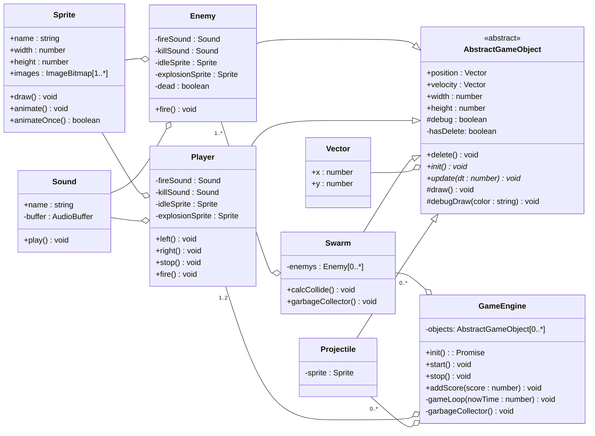

# Игровой движок <!-- omit in toc -->

- [UML диаграмма общих взаимосвязей](#uml-диаграмма-общих-взаимосвязей)
- [Базовые классы](#базовые-классы)
  - [GameEngine](#gameengine)
  - [AbstractGameObject](#abstractgameobject)
  - [Расчет столкновений](#расчет-столкновений)
  - [Sound](#sound)
  - [Sprite](#sprite)
  - [Vector](#vector)
- [Классы игровых объектов](#классы-игровых-объектов)
  - [Player](#player)
  - [Swarm](#swarm)
  - [Enemy](#enemy)
  - [Projectile](#projectile)
- [Вспомогательные классы](#вспомогательные-классы)
  - [SoundMap](#soundmap)
  - [SpriteMap](#spritemap)

## UML диаграмма общих взаимосвязей



## Базовые классы

### GameEngine

Основной класс, здесь запускается игровой цикл, здесь запускается инициализация всех игровых объектов. А также содержатся вспомогательные методы по работе с различной логикой игры.

Аргументы конструктора тип `TGameEngineOptions`

|        Имя        | Описание                                                |
| :---------------: | :------------------------------------------------------ |
|      **ctx**      | 2D контекст на котором будет рисоваться игра            |
|     **debug**     | флаг включения отладочной информации (default: `false`) |
|     **width**     | ширина игрового поля                                    |
|    **height**     | высота игрового поля                                    |
| **onScoreUpdate** | callback вызываемый в момент получения игроком очков    |
|  **onGameOver**   | callback вызываемый при окончании игры                  |

Пример инициализации и запуска игрового движка

```javascript
const gameEngine = new GameEngine({
  /* Опции */
});
gameEngine.registerObject([
  /* Классы игровых объектов: Player и Swarm */
]);
const initResult = await gameEngine.init();
if (!initResult) throw new Error('Ошибка инициализации');
gameEngine.start();
```

1. Создается instance игрового движка с указанными опциями
2. Вызывается метод `registerObject()` в который передаются классы основных игровых объектов которые будут созданы автоматически в процессе инициализации
3. Вызывается метод инициализации игрового движка `init()`, который возвращает `Promise<boolean>`
4. При удачной инициализации для старта игрового процесса вызывается метод `start()`

### AbstractGameObject

Абстрактный класс игрового объекта, содержит интерфейс необходимый для оперирования объектами в `GameEngine`

Аргументы конструктора тип `TGameObjectOptions`:

|     Имя      | Описание                                                                                                                                                                                     |
| :----------: | :------------------------------------------------------------------------------------------------------------------------------------------------------------------------------------------- |
|   **ctx**    | 2D контекст на котором будет рисоваться игра                                                                                                                                                 |
|  **debug**   | флаг включения отладочной информации (default: `false`), по умолчанию при вызове метода `debugDraw(color)` рисует полый прямоугольник цветом `color`, который игра интерпретирует как объект |
| **position** | координаты верхнего левого угла описывающего прямоугольника                                                                                                                                  |
| **velocity** | скорость движения по оси `x` и `y` соответственно                                                                                                                                            |
|  **width**   | ширина описывающего прямоугольника                                                                                                                                                           |
|  **height**  | высота описывающего прямоугольника                                                                                                                                                           |

Абстрактные методы для реализации в классах наследниках:

|    Имя     | Описание                                                                                                                                                                                             |
| :--------: | :--------------------------------------------------------------------------------------------------------------------------------------------------------------------------------------------------- |
|  **init**  | должен содержать в себе всю асинхронную логику инициализации игрового объекта, в случае успешной инициализации возвращать `true` иначе `false`                                                       |
| **update** | должен обновлять состояние игрового объекта вызывается в начале расчета кадра отрисовки, на вход получает время прошедшее с прошлого кадра. Должен содержать всю игровую логику (перемещение и т.д.) |
|  **draw**  | отрисовка игрового объекта, должен содержать всю логику работы с `canvas`                                                                                                                            |

### Расчет столкновений

Pure function `isRectCollide` проверяет пересекаются ли между собой да игровых объекта

```js
/* ... */
if (
    obj1.position.x + obj1.width >= obj2.position.x &&
    obj1.position.x <= obj2.position.x + obj2.width &&
    obj1.position.y + obj1.height >= obj2.position.y &&
    obj1.position.y <= obj2.position.y + obj2.width
  )
/* ... */
```


### Sound

Класс работы со звуками, использует [AudioContext](https://developer.mozilla.org/ru/docs/Web/API/AudioContext) в конструктор передается instance `AudioContext` и `AudioBuffer` который содержит в себе звуковую дорожку. Метод `play()` однократно воспроизводит звуковую дорожку.

Пример использования:

```javascript
const sound = new Sound(/* AudioContext */, /* AudioBuffer */);
sound.play();
```

### Sprite

Класс работы с изображениями, использует [ImageBitmap](https://developer.mozilla.org/ru/docs/Web/API/ImageBitmap).

Аргументы конструктора тип `TSpriteOptions`:

|      Имя      | Описание                                                                                                                                             |
| :-----------: | :--------------------------------------------------------------------------------------------------------------------------------------------------- |
|   **name**    | имя спрайта                                                                                                                                          |
|  **images**   | массив `ImageBitmap` содержащий кадры анимации если таковая имеется, иначе массив состоит из единственного элемента                                  |
| **animation** | _необязательный параметр_ объект описывающий анимацию, состоит из полей `frames` - количество кадров в анимации и `duration` - длительность анимации |

Для рисования статичного спрайта используется метод `draw(ctx, x, y)`, где `ctx` - 2D контекст, `x` и `y` - координаты верхней левой точки куда будет выводится изображение, также можно передать 4-ый необязательный параметр `frame` в котором можно указать номер кадра для отрисовки

Для рисования анимации используется метод `animate(ctx, x, y, dt)`,где `ctx` - 2D контекст, `x` и `y` - координаты верхней левой точки куда будет выводится изображение, `dt` - время прошедшее с предыдущего кадра. Также для проигрывания анимации один раз может использоваться метод `animateOnce(ctx, x, y, dt)`

Пример использования:

```javascript
const sprite = new Sprite({
  /* Опции */
});

// Статическая отрисовка на 2D контексте ctx по координатам x: 10, y: 10
sprite.draw(ctx, 10, 10);

// Рисования анимации на 2D контекста ctx по координатам x: 42, y: 24
sprite.animate(ctx, 42, 24, dt);

// Рисования анимации один раз на 2D контекста ctx по координатам x: 42, y: 24
sprite.animateOnce(ctx, 42, 24, dt);
```

_Note: Методы `draw()`, `animate()`, `animateOnce()` должы использоваться внутри метода `update()` игровых объектов._

### Vector

Класс для хранения и работы с векторной информацией. Хранит в себе две координаты по X и Y осям соответственно. конструктор принимает `x` и `y` координаты.

Поддерживаемые методы:

| Метод                   | Описание                                                                                                |
| :---------------------- | :------------------------------------------------------------------------------------------------------ |
| **v1.subtract(v2)**     | вычитает из элементов `v1` элементы `v2`, возвращает новый вектор с результатом                         |
| **v1.subtract(x1, y1)** | вычитает из элементов `v1` переданные аргументы, соответственно, возвращает новый вектор с результатомd |
| **v1.add(v2)**          | складывает одноименные элементы `v1` и `v1`, возвращает новый вектор с результатом                      |
| **v1.add(x1, x2)**      | складывает элементы `v1` и переданные аргументы соответственно, возвращает новый вектор с результатом   |
| **v1.length()**         | вычисляет длину вектора                                                                                 |
| **v1.dor(v2)**          | вычисляет скалярное произведение векторов                                                               |
| **v1.normalize()**      | приводит вектор к нормализованному виду                                                                 |

Пример использования:

```javascript
const v1 = new Vector(2, 3);
const v2 = new Vector(3, 2);

const res = v1.add(v2); // res = {x: 5, y: 5}
```

## Классы игровых объектов

### Player

Описывает логику работы с объектом игрока, наследуется от класса `AbstractGameObject`, расширяет его следующими методами:

| Метод       | Описание                               |
| :---------- | :------------------------------------- |
| **left()**  | двигает игрока влево по игровому полю  |
| **right()** | двигает игрока вправо по игровому полю |
| **stop()**  | останавливает движение игрока          |
| **fire()**  | производит выстрел игрока              |

_**Переопределен** метод `delete` базового класса для проигрывания звука взрыва игрока_

Аргументом конструктора является тип `TPlayerOptions` который добавляет в тип [`TGameObjectOptions`](#abstractgameobject) свойство `onFire` которое является callback функции вызываемой в момент произведения выстрела игрока, на вход получает объект пули игрока.

### Swarm

Описывает логику работы с объектом роя, наследуется от класса `AbstractGameObject`, расширяет его следующими методами:

| Метод                  | Описание                                                    |
| :--------------------- | :---------------------------------------------------------- |
| **calcCollide()**      | Проверяет факт столкновения пули и каждого врага внутри роя |
| **garbageCollector()** | Удаляет врагов внутри роя, которые считаются убитыми        |
| **revertVelocityX()**  | Изменяет скорость движение роя по оси X на противоположную  |

Аргументом конструктора является тип `TSwarmOptions` который добавляет в тип [`TGameObjectOptions`](#abstractgameobject) свойство `onFire` которое является callback функции вызываемой в момент произведения выстрела одного из врагов внутри роя, на вход получает объект пули игрока и свойство `formation` которое описывает построение врагов внутри роя.

Пример свойства `formation`:

```javascript
[
  [0, 0, 0, 0, 3, 3, 3, 3, 0, 0, 0, 0],
  [0, 0, 0, 2, 2, 2, 2, 2, 2, 0, 0, 0],
  [0, 0, 2, 2, 2, 2, 2, 2, 2, 2, 0, 0],
  [0, 1, 1, 1, 1, 1, 1, 1, 1, 1, 1, 0],
  [1, 1, 1, 1, 1, 1, 1, 1, 1, 1, 1, 1],
];
```

Цифры внутри массива, тип врага, используемый в класса `Enemy` ыдля выбора спрайта и логики поведения врага

### Enemy

Описывает логику работы с объектом врага, наследуется от класса `AbstractGameObject`, расширяет его следующими методами:

| Метод      | Описание                                                   |
| :--------- | :--------------------------------------------------------- |
| **fire()** | производит выстрел врага                                   |
| **isDead** | геттер, возвращает `true` если игрок уничтожил этого врага |

_**Переопределен** метод `delete` базового класса для проигрывания звука взрыва врага_

Аргументом конструктора является тип `TEnemyOptions` который добавляет в тип [`TGameObjectOptions`](#abstractgameobject) свойство `onFire` которое является callback функции вызываемой в момент произведения выстрела врага и свойство `type` которое определяет тип врага используемый для выбора спрайта и логики поведения врага.

### Projectile

Описывает объект пули, наследуется от класса `AbstractGameObject`. Аргументом конструктора является тип `TProjectileOptions` который добавляет в тип [`TGameObjectOptions`](#abstractgameobject) свойство `type` которое является типом пули (`ProjectileType.player` или `ProjectileType.enemy`) и свойство `sprite` которое определяет спрайт пули.

## Вспомогательные классы

### SoundMap

Используется для загрузки и хранения всех звуков игры.

Аргументом конструктора является объект типа `TAudioOptions`:

| Свойство  | Описание                                                                                              |
| :-------- | :---------------------------------------------------------------------------------------------------- |
| **sound** | Массив объектов содержащих поля: `name` - имя звука и `url` - адрес загрузки для каждого звука в игре |

Имеет один публичный метод `getSoundByName(name)` возвращающий экземпляр класса [`Sound`](###sound)

Пример использования:

```javascript
const soundMap = new SoundMap({
  sounds: [
    {
      name: 'fire',
      url: 'https://galaga.com/assets/sound/fire.mp3',
    },
    {
      name: 'kill',
      url: 'https://galaga.com/assets/sound/kill.mp3',
    },
  ],
});

const sound = soundMap.getSoundByName('fire');
```

### SpriteMap

Используется для загрузки и нарезки каты спрайтов на отдельные изображения.

Аргументом конструктора является объект типа `TSpriteMapOptions`:

|    Свойство    | Описание                                        |
| :------------: | :---------------------------------------------- |
|    **url**     | адрес для загрузки общей карты спрайтов         |
| **spriteSize** | размер спрайта в карте ('16', '32', '48', '64') |
|    **rows**    | количество строк спрайтов в карте               |
|    **cols**    | количество колонок в карте                      |
|  **sprites**   | массив описания спрайтов                        |

Описание спрайтов представляет собой объект типа `TSpriteInfo`:

|   Свойство    | Описание                                                                                                                                             |
| :-----------: | :--------------------------------------------------------------------------------------------------------------------------------------------------- |
|    **row**    | номер колонки в карте или диапазон строк                                                                                                             |
|    **col**    | номер строки в карте или диапазон колонок                                                                                                            |
|   **name**    | имя спрайта                                                                                                                                          |
|   **scale**   | _необязательный параметр_ масштаб отрисовки спрайта                                                                                                  |
| **animation** | _необязательный параметр_ объект описывающий анимацию, состоит из полей `frames` - количество кадров в анимации и `duration` - длительность анимации |

Имеет один публичный метод `getSpriteByName(name)` возвращающий экземпляр класса [`Sound`](###sprite)

Пример:

```javascript
const spriteMap = new SpriteMap({
  url: 'http://galaga.com/assets/sprite-map.png',
  spriteSize: '16',
  rows: 7,
  cols: 12,
  sprites: [
    {
      name: 'player',
      row: 0,
      col: 0,
      scale: 3, // увеличить спрайт в 3 раза
    },
    // получает объединенный спрайт состоящий из 4 квадратов 16x16
    // по координатам  0 и 1 строки, 1 и 2 столбцы. И так как указано количество кадров 4
    // повторяет операцию со смещением окна вырезания на ширину получившегося прямоугольника
    {
      name: 'player-explosion',
      row: [0, 1],
      col: [1, 2],
      scale: 3,
      animation: { frames: 4, duration: 2000 },
    },
  ],
});

const playerSprite = spriteMap.getSpriteByName('player');
```
