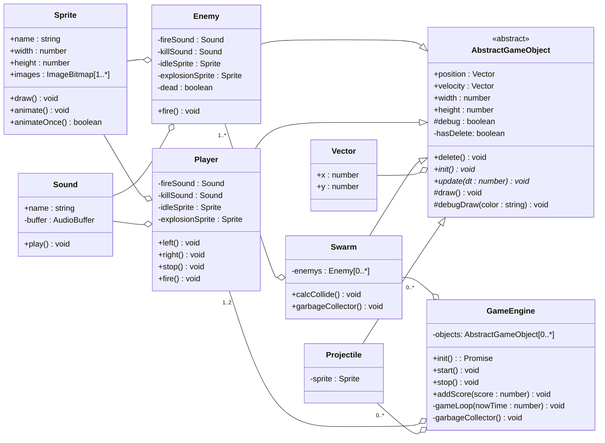

# Игровой движок <!-- omit in toc -->

Базовые классы:

- [UML диаграмма общих взаимосвязей](#uml-диаграмма-общих-взаимосвязей)
- [Базовые классы](#базовые-классы)
  - [GameEngine](#gameengine)
  - [AbstractGameObject](#abstractgameobject)
  - [Sound](#sound)
  - [Sprite](#sprite)
  - [Vector](#vector)
  - [Расчет столкновений](#расчет-столкновений)

## UML диаграмма общих взаимосвязей



## Базовые классы

### GameEngine

Основной класс, здесь запускается игровой цикл, здесь запускается инициализация всех игровых объектов. А также содержатся вспомогательные методы по работе с различной логикой игры.

### AbstractGameObject

Абстрактный класс игрового объекта, содержит интерфейс необходимый для оперирования объектами в `GameEngine`

### Sound

Класс работы со звуками

### Sprite

Класс работы с изображениями.

```javascript
const sprite = new Sprite({
  name: '<имяСпрайта>',
  imahes:
});
```

### Vector

Класс для хранения и работы с векторной информацией. Хранит в себе две координаты по X и Y осям соответственно.

Поддерживаемые методы:

- **вычитание**
  - `v1.subtract(v2)` - вычитает из элементов `v1` элементы `v2`, возвращает новый вектор с результатом.
  - `v1.subtract(x1, y1)` - вычитает из элементов `v1` переданные аргументы, соответственно, возвращает новый вектор с результатом.
- **сложение**
  - `v1.add(v2)` - складывает одноименные элементы `v1` и `v1`, возвращает новый вектор с результатом.
  - `v1.add(x1, x2)` - складывает элементы `v1` и переданные аргументы соответственно, возвращает новый вектор с результатом.
- **длинна вектора** `v1.length()`.
- **скалярное произведение** `v1.dor(v2)`.
- **нормализованный вектор** `v1.normalize()`.

### Расчет столкновений


